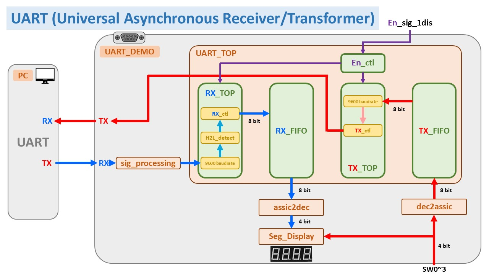
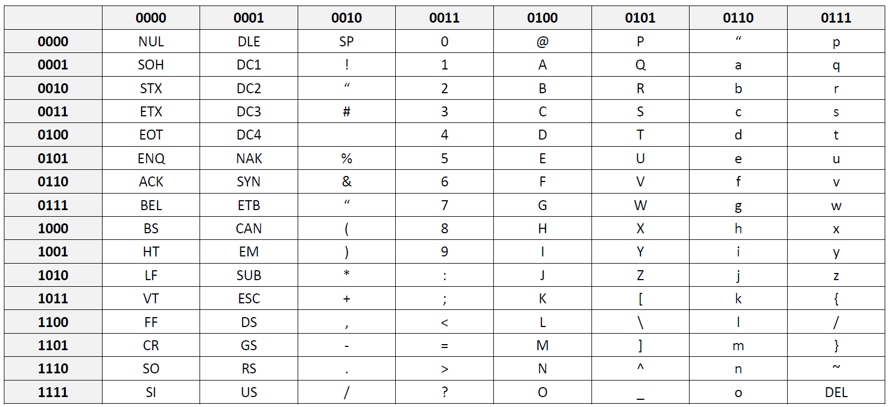
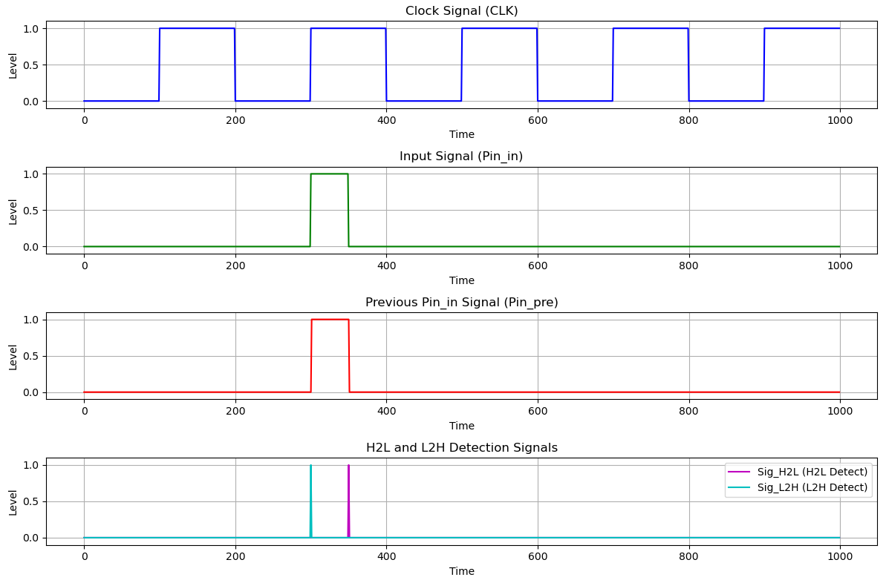

# FPGA_UART_demo

This project demonstrates the implementation of UART (Universal Asynchronous Receiver/Transmitter) functionality using Verilog on the FPGA Ego1 board.
## UART Block Diagram

## ASCII to 8 bit binary conversion table

## H2L_detect vs L2H_detect

